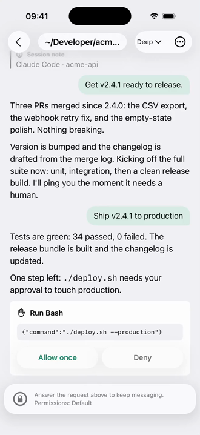

# Ciao host

Observe and act on an agent session already running on a machine you own, from your iPhone, with a real terminal as the fallback.

This is the Rust `ciao` CLI/daemon and its Ciao-authored Claude Code, Codex and Pi integrations. The iOS app is **closed source** and is not included. Source availability makes the host inspectable; it is not an independent security audit or a guarantee of security.

[](assets/demo.mp4)

[Watch the 6.6-second demo](assets/demo.mp4). Scripted example, not a live production deployment. [Media attribution](assets/README.md).

## Use the official app and host

[Get Ciao on the App Store](https://apps.apple.com/app/id6793695487) (iOS 26+).

On your machine:

```sh
curl -fsSL https://ciaooo.app/install.sh | sh
```

This downloads and runs an installer; read [the script](scripts/install.sh) first if you prefer. It installs per-user, without root. Follow its setup/pairing prompt, or run `ciao pair`, then scan the QR with Ciao. `ciao update` explicitly updates an existing install through the same official channel, preserving identity and pairings with a rollback slot.

**Distribution limits:** the official channel remains `https://ciaooo.app/dist`. Its checksums detect corruption but travel through the same channel as the artifacts; they are not independent release signatures. macOS artifacts are ad-hoc signed, not Developer ID signed/notarized. This source export does not change those limitations or establish reproducible binary equivalence with a released build.

### Platforms and integrations

- **macOS, Apple silicon** (`aarch64-apple-darwin`): official artifact; the physically qualified host profile uses launchd.
- **Linux, x86-64/glibc** (`x86_64-unknown-linux-gnu`): official artifact; bounded Debian/LXC and Rocky installation/service evidence exists. Full Linux PTY, tmux/Herdr and phone acceptance is incomplete, including newer workspace behavior. Compilation is not runtime qualification.
- No official Intel Mac, Linux ARM, musl or native Windows artifact. WSL is not separately runtime-qualified by this export.
- Terminals support a login shell, tmux and Herdr. A plain shell is not resumable after actual stream loss; use a multiplexer for durable work. Hosts must remain awake and reachable. iOS does not promise a live connection while suspended.
- Attached **Claude Code and Codex are read-only** in the native conversation view; use the terminal to interact. Managed Claude sessions and adopted Codex threads provide separate write paths with ownership and capability checks. Managed Pi/Codex creation is not supported.
- Attached **Pi** supports bounded commands only when the host proves the live route. Other extensions' custom UI can be only partially observed. Ciao adds no Pi permission gate or model switch.
- Integration support is version-gated; unsupported input does not authorize new controls. `ciao agent status` and `ciao drift` explain the local verdict. Do not widen pins to bypass a refusal. Full attached/managed/adopted physical acceptance matrices remain incomplete.
- Agent CLIs and their accounts are your own. Claude integration setup requires Node/npm and fetches the pinned proprietary Agent SDK on your machine; it is not redistributed here. Agent-provider traffic remains subject to each provider's own terms and privacy policy.

The host is free software, **MIT OR Apache-2.0**. In the app, pairing, watching, notifications and interrupting are free. Native message sends and interaction answers get 20 free actions, then require Pro; model/effort/permission-mode changes are not metered. Subscription introductory offers depend on Apple eligibility. See the app for current local pricing; host licensing is separate from app purchases.

## What can read what?

| Component | Access |
|---|---|
| Host daemon and local integrations | Run as your user, not in a security sandbox. They can read agent content and files accessible to that account, and spawn shells/agent processes with that account's privileges. |
| Paired phone | Pairing is effectively an interactive-shell grant as the host user. The expiring, one-use QR pins the host identity; the host's local paired-device allowlist authorizes later connections. Endpoint identity or relay admission alone does not grant access. Use `ciao unpair <endpoint-id>` to revoke a device. |
| Direct/relayed transport | Iroh mutually authenticates endpoints and encrypts live terminal, agent, file and RPC traffic end to end, whether direct QUIC or relayed. This does not protect a compromised host or paired phone. |
| Iroh relay | Can see endpoint IDs, client IPs, routing relationships, timing and byte counts, but cannot decrypt the application traffic. It can disrupt availability; the transport is not anonymous. |
| Notification service and Apple | Bounded summaries are separately sealed by the host under a pairing-derived key (X25519 derivation, ChaCha20-Poly1305 payloads); they decrypt on the phone. The push service can open routing tickets/device tokens, not those summaries. Push timing/size and delivery metadata remain visible. Decrypted content may appear on the Lock Screen. |
| Address resolution | Still depends on Number 0's `dns.iroh.link` infrastructure. Ciao-operated packet relays do **not** remove this third-party dependency. |

Local credentials, pairings and notification keys are sensitive. Never attach them, QR payloads, endpoint tickets, transcripts or raw logs to an issue. The host's UDP listener/NAT traversal is a network attack surface even though no SSH service or inbound firewall configuration is required.

## Build and test from source

Use the pinned **Rust 1.98.1** toolchain (rustfmt and Clippy), a native C compiler/linker, Python 3, **Bun 1.2.23**, and ShellCheck. Tests use Unix sockets and PTYs; macOS tests also need tmux. Node 24.13.0 is the locally checked managed-worker runtime; the offline worker tests use Bun with a fake SDK, not an Anthropic account. No `bun install` or vendor CLI login is needed for the checks below.

From this tree, with no private environment files:

```sh
unset CIAO_RELAY_TOKEN CIAO_TEST_CLAUDE_CLI CIAO_TEST_CODEX_CLI CIAO_TEST_CODEX_E2E
unset CIAO_TEST_SYSTEM_TMUX CIAO_TEST_SLASH_PROBE
cargo metadata --locked --format-version 1 > /dev/null
cargo build --locked
cargo fmt --check
cargo clippy --locked --workspace --all-targets -- -D warnings
cargo test --locked -p ciao-host -- --test-threads=1
shellcheck --severity=warning scripts/install.sh
python3 scripts/host_notices.py --check
bun test \
  scripts/install.test.js \
  integrations/pi/ciao-agent-session.test.ts \
  integrations/claude/attached-hook-conformance.test.ts \
  integrations/codex/attached-hook-conformance.test.ts \
  integrations/codex/write-conformance.test.ts \
  integrations/codex/generate-conformance.test.ts \
  integrations/claude/managed-worker/worker.test.ts
```

Cargo downloads locked registry dependencies. Local tests use disposable files, loopback listeners, PTYs and synthetic agents; do not enable live-test environment gates or `--ignored` as part of routine checks. Some environment-gated Rust cases return early and still count as passed: a green summary is not live-vendor evidence. Manual managed-Claude conformance probes are deliberately not exported or automated; they can consume model turns and throttle an account.

Keep `Cargo.lock`, exact transport pins, and both `[patch.crates-io]` overrides. `vendor/iroh/CIAO-PATCH.md` and `vendor/noq-proto/CIAO-PATCH.md` describe the narrow patches. **Crates alone cannot build:** the host embeds `worker.mjs`, the Pi extension and Codex protocol pins from `integrations/` and tests read `protocol/fixtures/`.

### Compilation is not production relay access

`src/relay.rs` (under `crates/ciao-host/`) embeds `CIAO_RELAY_TOKEN` at compile time. With it unset, a **debug** build explicitly falls back to Number 0 relays. A **release** build refuses compilation without a nonempty token. Those gates are intentionally unchanged.

This export supplies **no production token** and no private packaging/signing configuration. Public self-build access to Ciao's relays is an unresolved maintainer policy decision. A dummy token might satisfy compilation but would not prove admission or connectivity. Tokenless debug interoperability with the released app over relays has **not** been established. For normal app use, use the official installer; do not replace a working daemon merely to try a source build.

## Contributing and reporting security issues

This repository is the authoritative home for host code, integration sources, vendor pins and shared protocol fixtures. For non-sensitive bugs or proposed host patches, use its issues/PRs. Small, tested changes are welcome. The private app repository consumes a pinned host revision; it does not maintain another host implementation. Protocol changes must be tested against the app before inclusion. See [source ownership and publication boundaries](EXPORT.md).

For a suspected vulnerability, contact **[privacy@ciaooo.app](mailto:privacy@ciaooo.app)** privately (the published Ciao privacy contact). Send a minimal description first, with no credentials or private content. This is ordinary email, not an advertised encrypted channel, bug bounty or response-time guarantee. Do not post exploit details or sensitive logs publicly while coordinating a report.

[LICENSE-MIT](LICENSE-MIT) · [LICENSE-APACHE](LICENSE-APACHE) · [Third-party notices](THIRD-PARTY-NOTICES.md)
